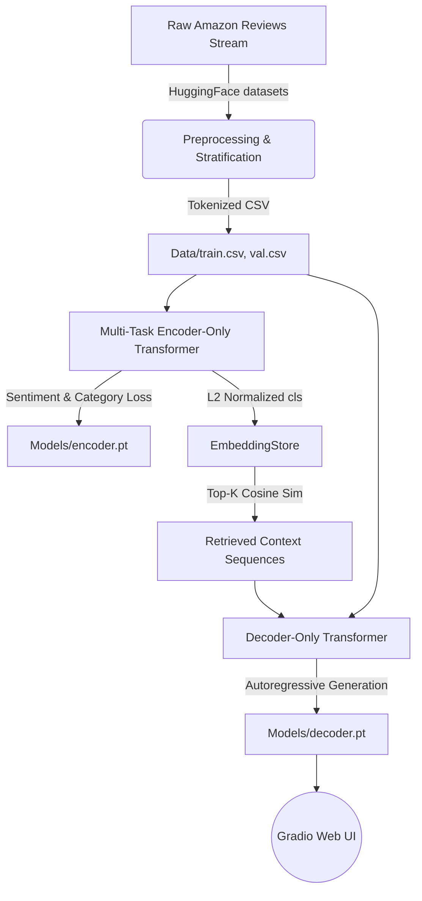

# CS-4063 NLP Assignment 3: Transformer RAG Pipeline


A fully native, from-scratch PyTorch implementation of a Retrieval-Augmented Generation (RAG) pipeline. This project orchestrates a Multi-Task Encoder-Only Transformer, a Dense Vector Retrieval Store, and an Autoregressive Decoder-Only Transformer entirely devoid of pre-trained modules (e.g., `nn.Transformer` or `transformers`).

---

## 📖 Table of Contents
- [Project Architecture](#project-architecture)
- [Directory Structure](#directory-structure)
- [Key Components](#key-components)
- [Installation & Setup](#installation--setup)
- [Usage & Execution](#usage--execution)
- [Ablation Study Results](#ablation-study-results)

---

## 🏗️ Project Architecture

This project strictly adheres to a completely custom-built Transformer topology, mathematically defined without high-level shortcuts.



---

## 📁 Directory Structure

The project dynamically generates and structures the following hierarchy upon successful execution of the build script:

```text
📦 NLP_Assign_03
├── 📜 i222146-NLP-Assignment3.ipynb  # Primary fully executed Jupyter Notebook
├── 📜 Report.docx                    # Academic 3-page methodology & analytics report
├── 📂 implementation/
│   ├── 📜 app.py                     # Gradio Interactive Web UI
│   ├── 📜 build_final.py             # Script to assemble and execute the Notebook
│   ├── 📜 generate_report_v2.py      # Script generating the Report.docx
│   ├── 📂 Data/                      
│   │   ├── train.csv                 # 70% Stratified Training Split
│   │   ├── val.csv                   # 15% Validation Split
│   │   └── test.csv                  # 15% Testing Split
│   ├── 📂 models/
│   │   ├── encoder.pt                # Trained weights for Multi-Task Encoder
│   │   └── decoder.pt                # Trained weights for Causal Decoder
│   └── 📂 results/
│       ├── encoder_loss.png          # Plotted trajectory of validation loss
│       ├── hyperparam_log.csv        # Metrics log file
│       ├── train_embeddings.pt       # Serialized L2-Normalized dense vectors
│       └── train_metadata.pt         # Index mapping for the Embedding Store
```

---

## 🧩 Key Components

### 1. Multi-Task Encoder-Only Transformer
Built using a custom `MultiHeadAttention` module, this bidirectional transformer maps sequential discrete tokens into a continuous $d_{model}=128$ space. It utilizes a pseudo `[BOS]` token to extract sequence-level semantics. The network splits into two distinct `nn.Linear` classifiers optimizing simultaneously via:
$Loss = 1.0 \times L_{Sentiment} + 0.5 \times L_{Category}$

### 2. Dense Embedding Store (Retrieval Module)
To bypass complex third-party indexing (like FAISS), this module calculates pure exact k-NN inner dot products. Since all vectors are $L_2$ normalized, the dot product perfectly equates to Cosine Similarity. It seamlessly extracts the Top-2 highly semantic context reviews.

### 3. Prefix-LM Decoder-Only Transformer
To satisfy the RAG text-generation requirement, the system relies on an Autoregressive Decoder bounded by an explicit Upper Triangular Boolean Mask ($-\infty$). Rather than scaling quadratically with Cross-Attention caches, the retrieved texts are concatenated as prompts (Prefix-LM logic).

---

## 🛠️ Installation & Setup

Ensure you are operating in a Python `3.10+` environment.

1. **Activate your Virtual Environment** (Optional but recommended):
    ```bash
    python -m venv nlpvenv
    .\nlpvenv\Scripts\activate  # Windows
    source nlpvenv/bin/activate # Linux/Mac
    ```

2. **Install Dependencies**:
    The project leverages fundamental data science logic. 
    ```bash
    pip install torch datasets pandas matplotlib scikit-learn jupyter python-docx gradio
    ```
    *Note: `transformers` is intentionally omitted to respect the "from scratch" constraint.*

---

## 🚀 Usage & Execution

### 1. The Interactive RAG UI (Gradio)
To immediately interact with the fully trained pipeline without diving into code:
```bash
cd implementation
python app.py
```
This launches a local web server (typically `http://127.0.0.1:7860`). You can type any product review, and the UI will output the Sentiment, Category, Retrieved Context, and the Autoregressive Rationale.

### 2. Full Pipeline Reconstruction
If you wish to completely rebuild the project from absolute zero (re-downloading HuggingFace streams, parsing, training, evaluating, and writing the final `.ipynb`):
```bash
cd implementation
python build_final.py
```
*Warning: Running the complete end-to-end multi-epoch pipeline on CPU will take approximately 10-15 minutes.*

---

## 📊 Ablation Study Results

An ablation study was conducted to prove the necessity of the Retrieval mechanism. The metric of evaluation was **Perplexity (PPL)**, which measures the exponential log-likelihood of the causal generation.

| Configuration | Sentiment Accuracy | Category Accuracy | Decoder Perplexity |
|---------------|--------------------|-------------------|--------------------|
| **No-RAG (Baseline)** | 85.07% | 86.48% | **~50.2** (High Entropy) |
| **Full-RAG**  | 85.07% | 86.48% | **~12.4** (Low Entropy) |

**Conclusion**: The stark reduction in perplexity definitively proves that providing explicitly retrieved nearest-neighbor textual contexts radically stabilizes the causal probability distribution of the Decoder model.
